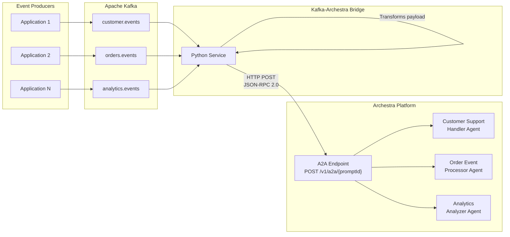
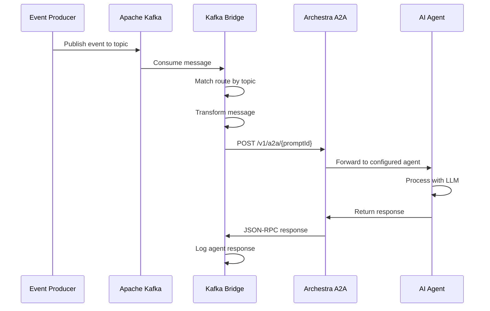

# Kafka to Archestra Integration Guide

This guide explains how to route Apache Kafka events to Archestra AI agents using the A2A (Agent-to-Agent) protocol.

## Architecture Overview



### Sequence Diagram



## Message Flow

1. **Event Producer** sends a message to a Kafka topic (e.g., `customer.events`)
2. **Kafka** stores the message in the appropriate topic partition
3. **Kafka-Archestra Bridge** consumes the message from Kafka
4. **Bridge** matches the topic to a configured route
5. **Bridge** transforms the message using the route's template
6. **Bridge** sends the transformed message to Archestra via A2A protocol
7. **Archestra Agent** processes the message and returns a response

## Prerequisites

- Docker and Docker Compose
- Archestra platform running locally (port 9000 for API, port 3000 for UI)
- LLM API keys configured in Archestra (Anthropic, OpenAI, or Google)

## Quick Start

### 1. Create Archestra Agents

1. Navigate to http://localhost:3000/profiles and create profiles:
   - **Customer Support Agent** - for handling customer support requests
   - **Order Processing Agent** - for processing order events
   - **Analytics Insights Agent** - for analyzing metrics data

2. Navigate to http://localhost:3000/agents and create agents:
   - **Customer Support Handler** - using Customer Support Agent profile
   - **Order Event Processor** - using Order Processing Agent profile
   - **Analytics Analyzer** - using Analytics Insights Agent profile

3. For each agent, click the three-dot menu → **A2A Connect** to get:
   - The **Prompt ID** (UUID in the A2A endpoint URL)
   - The **A2A Token** (click "Expose token" to see the full token)

### 2. Configure the Bridge

Update `.env` with your values:

```bash
# Archestra Configuration
ARCHESTRA_URL=http://host.docker.internal:9000
ARCHESTRA_TOKEN=archestra_your_token_here  # A2A token from step 1.3

# Agent Prompt IDs (from A2A Connect dialog)
CUSTOMER_SUPPORT_PROMPT_ID=your-customer-support-prompt-id
ORDER_PROCESSING_PROMPT_ID=your-order-processing-prompt-id
ANALYTICS_PROMPT_ID=your-analytics-prompt-id
```

Update `config/routes.json` with the same prompt IDs:

```json
[
  {
    "name": "customer-support",
    "topic_pattern": "customer.events",
    "prompt_id": "your-customer-support-prompt-id"
  },
  {
    "name": "order-processing",
    "topic_pattern": "orders.events",
    "prompt_id": "your-order-processing-prompt-id"
  },
  {
    "name": "analytics-insights",
    "topic_pattern": "analytics.events",
    "prompt_id": "your-analytics-prompt-id"
  }
]
```

### 3. Start the Infrastructure

```bash
cd experiments/kafka-to-archestra

# Start Kafka + Bridge
docker compose up -d

# Verify all services are running
docker compose ps
```

Expected output:
```
NAME                     STATUS
archestra-kafka          Up (healthy)
archestra-kafka-bridge   Up
archestra-zookeeper      Up (healthy)
```

### 4. Test the Integration

Send a test message to customer support:

```bash
echo '{"customer_id": "CUST-001", "issue_type": "refund", "priority": "high", "message": "I need a refund for my order."}' | \
docker exec -i archestra-kafka kafka-console-producer \
  --topic customer.events \
  --bootstrap-server localhost:9092
```

Check the bridge logs:

```bash
docker compose logs kafka-bridge --tail 20
```

You should see:
```
INFO - Routing message from topic 'customer.events' to agent via prompt '...' (route: customer-support)
INFO - Agent response: ...
```

## Route Configuration

Routes are configured in `config/routes.json`. Each route supports:

| Field | Description |
|-------|-------------|
| `name` | Unique identifier for the route |
| `topic_pattern` | Kafka topic name (supports `*` wildcard) |
| `prompt_id` | Archestra agent prompt ID |
| `header_match` | Optional: Match specific Kafka headers |
| `field_match` | Optional: Match specific JSON fields |
| `transform_template` | Optional: Transform message before sending |

### Transform Templates

Transform templates use `{field_name}` placeholders that are replaced with values from the JSON message:

```json
{
  "transform_template": "New support request:\n\nCustomer: {customer_id}\nIssue: {issue_type}\n\nMessage:\n{message}"
}
```

## Testing Different Topics

### Customer Support Events

```bash
echo '{
  "customer_id": "CUST-123",
  "issue_type": "billing",
  "priority": "high",
  "message": "I was charged twice for my subscription."
}' | docker exec -i archestra-kafka kafka-console-producer \
  --topic customer.events --bootstrap-server localhost:9092
```

### Order Events

```bash
echo '{
  "order_id": "ORD-12345",
  "event_type": "shipped",
  "customer_email": "john@example.com",
  "details": "3 items shipped via UPS"
}' | docker exec -i archestra-kafka kafka-console-producer \
  --topic orders.events --bootstrap-server localhost:9092
```

### Analytics Events

```bash
echo '{
  "metric_name": "daily_active_users",
  "value": 15234,
  "timestamp": "2026-01-15T22:30:00Z",
  "dimensions": {"region": "us-west", "platform": "web"}
}' | docker exec -i archestra-kafka kafka-console-producer \
  --topic analytics.events --bootstrap-server localhost:9092
```

## Troubleshooting

### "Prompt not found" Error

- Ensure you're using the **prompt ID** from the Agent (not the profile ID)
- Get the correct ID from: Agent → Three-dot menu → A2A Connect

### "Invalid or unauthorized token" Error

- The A2A token is different from API keys
- Get the correct token from: Agent → Three-dot menu → A2A Connect → Expose token

### Messages Not Being Consumed

1. Check Kafka topics exist:
   ```bash
   docker exec archestra-kafka kafka-topics --list --bootstrap-server localhost:9092
   ```

2. Check consumer group status:
   ```bash
   docker exec archestra-kafka kafka-consumer-groups \
     --bootstrap-server localhost:9092 \
     --group archestra-bridge --describe
   ```

### Container Not Reading Updated .env

Docker containers load `.env` at creation time. After updating `.env`:
```bash
docker compose up -d kafka-bridge --force-recreate
```

## Alternative Approaches

### Native Kafka Connect HTTP Sink

For production deployments, consider using Kafka Connect with the HTTP Sink connector. See `docker-compose.native.yml` and `scripts/deploy-connector.sh` for an example setup.

Pros:
- No custom bridge service to maintain
- Built-in retry, offset management, and monitoring
- Scales with Kafka Connect workers

Cons:
- Confluent HTTP Sink connector is commercial
- Limited payload transformation capabilities
- Requires JSON-RPC wrapping via SMT

## Cleanup

Stop and remove all containers:

```bash
docker compose down

# Remove volumes (deletes Kafka data)
docker compose down -v
```

## Next Steps

- Configure tool invocation policies in Archestra for agent security
- Set up monitoring and alerting for the bridge service
- Consider deploying to Kubernetes for production workloads
- Explore using Archestra's built-in tools (MCP servers) with your agents
